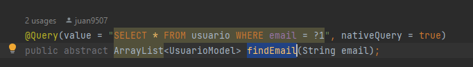
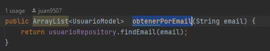
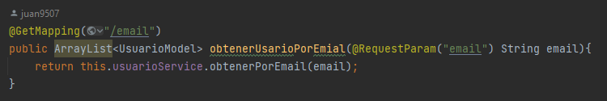
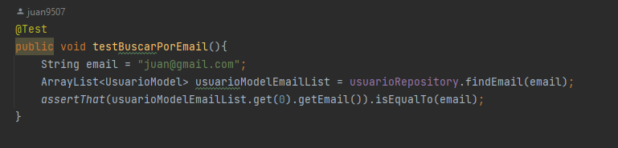

# crub-js-vanilla-backend
proyecto backend creando api rest spring, consumiendo
api con javaScript

Se creo el metodo para buscar con correo
en este caso con @Query

Prueba unitaria, canbiar la variable email, por un 
email que exista en su base de datos
